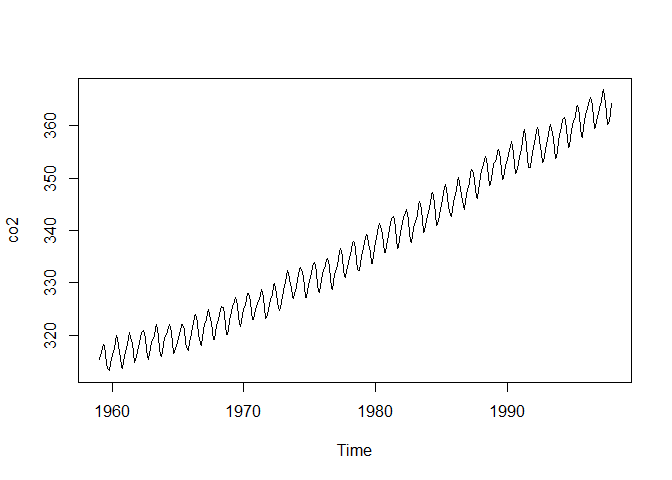

Chapter 1: Introduction
================

## 1.1 What Is Time Series Analysis?

- Look at the annual flow data of the Nile river — we don’t see a
  particular pattern.
- Or alternatively, look at Mauna Loa co2 concentration — regular
  seasonality.

``` r
Nile |> plot()
```


``` r
co2 |> plot()
```



- Time series modeling can generally be classified in three regions of
  estimation: *smoothing* (the past), *filtering* (the present), and
  *prediction* (the future).
- This book covers discrete, univariate time series sampled at regular
  intervals.

## 1.2 Two Approaches in Time Series Analysis

- Time series data, unlike other types, has explicit correlation across
  observations. Flow in the Nile today is correlated with flow tomorrow!
- Two approaches: *deterministic* (point estimate) and *stochastic*
  (i.e., estimate a distribution).

## 1.3 Use of R

### 1.3.1 Library in R and External Software

- Need to use `{dlm}`, `{pomp}`, and `{nimble}`.

### 1.3.2 Code and Data in This Book

- Beep boop

## Notation in This Book

- Covers notation. Quarto’s github-flavored-markdown tested below.

$$
\begin{align*}
\text{equation test} &= \alpha_{\text{subscript}}^{\text{superscript}} + \frac{\text{numerator}}{\text{denominator}} \\
\text{a second equation} &= \text{other words}
\end{align*}
$$
