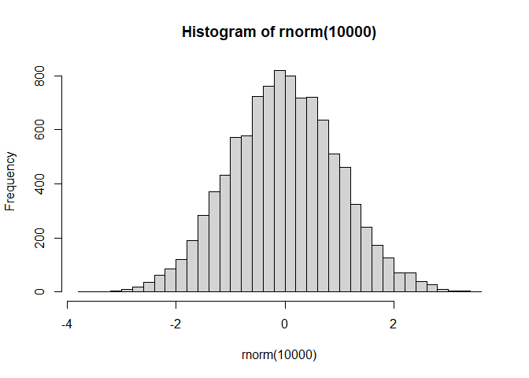
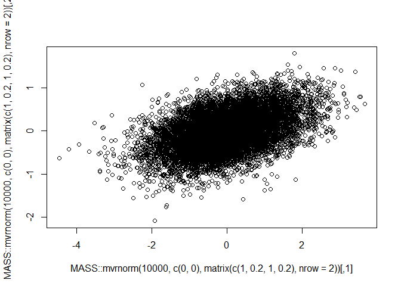
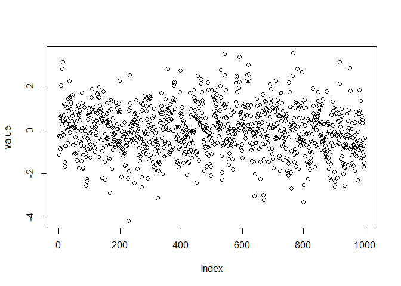
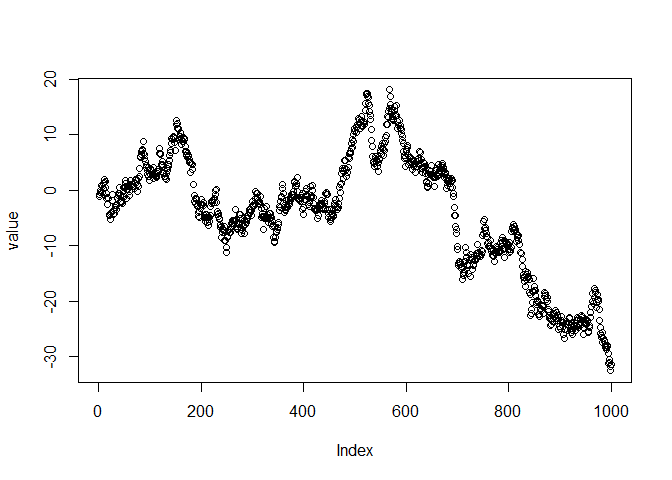

Chapter 2: Fundamentals of Probability and Statistics
================

## 2.1 Probability

- Yeep — probability distributions sum to 1 dawg

## 2.2 Mean and Variance

- Yeah dawg mean and variance

## 2.3 Normal Distribution

``` r
rnorm(1e4) |> hist(breaks = 40)
```



``` r
MASS::mvrnorm(1e4, c(0, 0), matrix(c(1, 0.2, 1, 0.2), nrow = 2)) |>
  plot()
```



## 2.4 Relation Among Multiple Random Variables

- When there are multiple random variables, the probability they will
  coincide is the *joint probability*, with distribution $p(x,y)$.
- When there are multiple random variables, the probability distribution
  of a specific variable is the *marginal probability*.
- Integrating == marginalizing, i.e.:

$$
p(x) = \int \ p(x,y) \text{d}y
$$

- When there are multiple random variables, the probability of one given
  another is the *conditional probability*, $p(x|y)$.

## 2.5 Stochastic Process

- A series of random variables dawg.

## 2.6 Covariance and Correlation

- Correlation is just the normalized covariance dawg.
- Note that autocovariance and autocorrelation in the context of time
  series data is simply the covariance/correlation of a data point and a
  time-shifted data point (i.e., the correlation between $X_t$ and
  $X_{t-1}$).

## 2.7 Stationary and Nonstationary Processes

- Stationary in the context of time series refers to the stochastic
  processes.
- As a contrast with nonstationary processes:

> For a stationary stochastic process, the correlation function $R(t,k)$
> and autocorrelation coefficient $\rho_{t,k}$ become $R(k)$ and
> $\rho_k$, respectively; the argument of these functions is only a lag
> $k$.

- Let’s consider an **AR(1)** model.

$$
\begin{align*}
Y_t & = \phi Y_{t-1} + \epsilon_t \\
\text{OR} \\
Y_t & \sim \text{Normal}(\mu_t, \sigma) \\
\mu_t & = \phi Y_{t-1}
\end{align*}
$$

- When $|\phi| < 1$, the process is stationary. Otherwise the AR(1)
  process is nonstationary.

``` r
plot_ar1 <- function(phi) {
  
  value <- vector(length = 1000)
  epsilon <- rnorm(length(value))
  
  for (i in 1:length(value)) {
    if (i == 1) {
      value[i] <- epsilon[i]
    } else {
      value[i] <- phi * value[i - 1] + epsilon[i]
    }
  }
  
  plot(value)
  
}

plot_ar1(0.5)
```



``` r
plot_ar1(1)
```



## 2.8 Maximum Likelihood Estimation and Bayesian Estimation

- Frequentist perspective maximizes the log-likelihood of the density of
  the parameters.
- Bayesian perspective updates parameter estimates via Bayes’ theorem.
