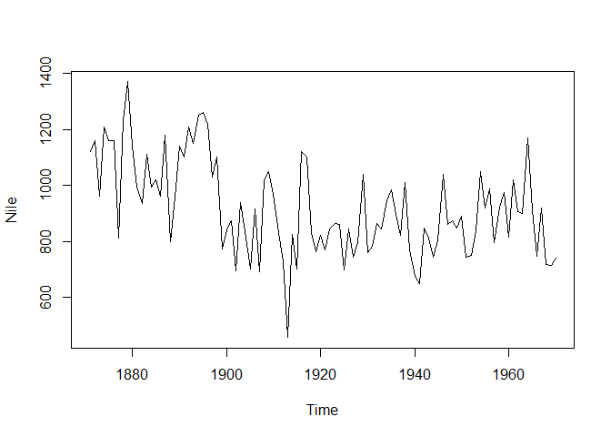
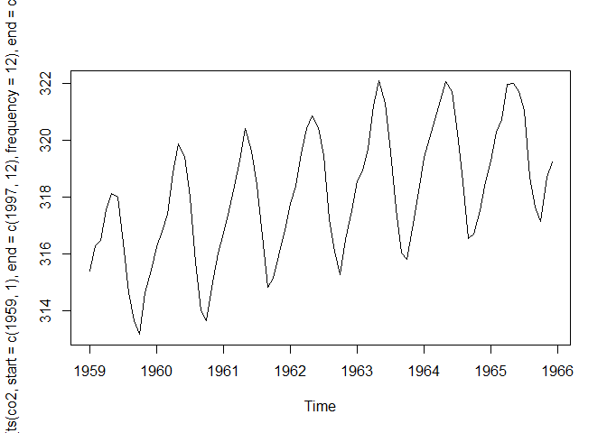
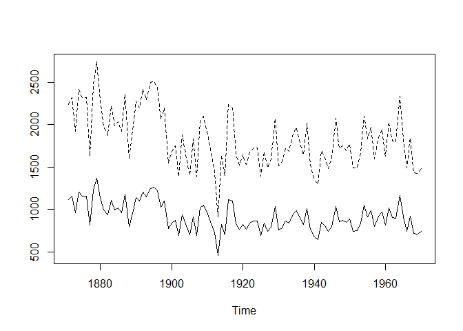

Chapter 3: Fundamentals of Handling Time Series Data with R
================

## 3.1 Object for Handling Time Series

- Base R’s `ts` class is used for handling time series objects.

``` r
Nile
```

    Time Series:
    Start = 1871 
    End = 1970 
    Frequency = 1 
      [1] 1120 1160  963 1210 1160 1160  813 1230 1370 1140  995  935 1110  994 1020
     [16]  960 1180  799  958 1140 1100 1210 1150 1250 1260 1220 1030 1100  774  840
     [31]  874  694  940  833  701  916  692 1020 1050  969  831  726  456  824  702
     [46] 1120 1100  832  764  821  768  845  864  862  698  845  744  796 1040  759
     [61]  781  865  845  944  984  897  822 1010  771  676  649  846  812  742  801
     [76] 1040  860  874  848  890  744  749  838 1050  918  986  797  923  975  815
     [91] 1020  906  901 1170  912  746  919  718  714  740

``` r
Nile |> plot()
```



- Time series objects specify the start, end, and frequency of the data
  in the series.

``` r
co2 |> 
  ts(start = c(1959, 1),
     end = c(1997, 12),
     frequency = 12) |> 
  window(end = c(1965, 12)) |>
  plot()
```



``` r
# demonstrate some of base R's ts plotting generics...

Nile |>
  
  # artificially shift Nile data back 5 years
  ts(start = 1866) |> 
  
  # join back with original unaltered Nile data
  ts.union(Nile)
```

    Time Series:
    Start = 1866 
    End = 1970 
    Frequency = 1 
         ts(Nile, start = 1866) Nile
    1866                   1120   NA
    1867                   1160   NA
    1868                    963   NA
    1869                   1210   NA
    1870                   1160   NA
    1871                   1160 1120
    1872                    813 1160
    1873                   1230  963
    1874                   1370 1210
    1875                   1140 1160
    1876                    995 1160
    1877                    935  813
    1878                   1110 1230
    1879                    994 1370
    1880                   1020 1140
    1881                    960  995
    1882                   1180  935
    1883                    799 1110
    1884                    958  994
    1885                   1140 1020
    1886                   1100  960
    1887                   1210 1180
    1888                   1150  799
    1889                   1250  958
    1890                   1260 1140
    1891                   1220 1100
    1892                   1030 1210
    1893                   1100 1150
    1894                    774 1250
    1895                    840 1260
    1896                    874 1220
    1897                    694 1030
    1898                    940 1100
    1899                    833  774
    1900                    701  840
    1901                    916  874
    1902                    692  694
    1903                   1020  940
    1904                   1050  833
    1905                    969  701
    1906                    831  916
    1907                    726  692
    1908                    456 1020
    1909                    824 1050
    1910                    702  969
    1911                   1120  831
    1912                   1100  726
    1913                    832  456
    1914                    764  824
    1915                    821  702
    1916                    768 1120
    1917                    845 1100
    1918                    864  832
    1919                    862  764
    1920                    698  821
    1921                    845  768
    1922                    744  845
    1923                    796  864
    1924                   1040  862
    1925                    759  698
    1926                    781  845
    1927                    865  744
    1928                    845  796
    1929                    944 1040
    1930                    984  759
    1931                    897  781
    1932                    822  865
    1933                   1010  845
    1934                    771  944
    1935                    676  984
    1936                    649  897
    1937                    846  822
    1938                    812 1010
    1939                    742  771
    1940                    801  676
    1941                   1040  649
    1942                    860  846
    1943                    874  812
    1944                    848  742
    1945                    890  801
    1946                    744 1040
    1947                    749  860
    1948                    838  874
    1949                   1050  848
    1950                    918  890
    1951                    986  744
    1952                    797  749
    1953                    923  838
    1954                    975 1050
    1955                    815  918
    1956                   1020  986
    1957                    906  797
    1958                    901  923
    1959                   1170  975
    1960                    912  815
    1961                    746 1020
    1962                    919  906
    1963                    718  901
    1964                    714 1170
    1965                    740  912
    1966                     NA  746
    1967                     NA  919
    1968                     NA  718
    1969                     NA  714
    1970                     NA  740

``` r
# plot multiple time series together
(2 * Nile) |>
  cbind(Nile) |>
  ts.plot(lty = c("dashed", "solid"))
```



## 3.2 Handling of Time Information

- `tsp()` can extract or set a combination of start time, end time, and
  frequency from a `ts` object.
- `time()` can extract a sequence of time values from the `ts` object.

``` r
tsp(Nile)
```

    [1] 1871 1970    1

``` r
time(Nile)
```

    Time Series:
    Start = 1871 
    End = 1970 
    Frequency = 1 
      [1] 1871 1872 1873 1874 1875 1876 1877 1878 1879 1880 1881 1882 1883 1884 1885
     [16] 1886 1887 1888 1889 1890 1891 1892 1893 1894 1895 1896 1897 1898 1899 1900
     [31] 1901 1902 1903 1904 1905 1906 1907 1908 1909 1910 1911 1912 1913 1914 1915
     [46] 1916 1917 1918 1919 1920 1921 1922 1923 1924 1925 1926 1927 1928 1929 1930
     [61] 1931 1932 1933 1934 1935 1936 1937 1938 1939 1940 1941 1942 1943 1944 1945
     [76] 1946 1947 1948 1949 1950 1951 1952 1953 1954 1955 1956 1957 1958 1959 1960
     [91] 1961 1962 1963 1964 1965 1966 1967 1968 1969 1970

- `Date` class is good for holding time data with resolution to the day.
- `POSIXct/POSIXlt` is good for holding time data with resolution to the
  second.

> There are a whole host of tidy extensions to all of these object. I’m
> largely ignoring them for the sake of this book.
