Chapter 4: Quick Tour of Time Series Analysis
================

Hagiwara’s workflow for time series analysis:

1.  confirmation of the purpose and data collection
2.  preliminary examination of the data
3.  model definition
4.  specification of parameter values
5.  execution of filtering, prediction, and smoothing
6.  diagnostic checking of results
7.  return to 1.

## 4.1 Confirmation of the Purpose and Data Collection

- Oftentimes, the initial data collection plan differs from what we
  actually need, and this is problematic when the difference is
  discovered after collecting & initially analyzing.
- This chapter is going to work with the `Nile`, `co2`, `UKgas`, and an
  artificially generated dataset from a nonlinear model.

## 4.2 Preliminary Examination of Data

- Some quick plots/metrics that Hagiwara suggests:
  - target over time
  - histogram/5-number summary
  - autocorrelation coefficient
  - frequency spectrum
- Some other notes that may be evident from a quick visual inspection:
  - Known time point where data changes drastically (for example, Musk
    tweets affecting stock prices)
  - Lograthmic changes in values
  - Clear mistakes (?)
  - Low/no autocorrelation -\> no need for time series!
  - Periodicity

## 4.2.1 Plot with Horizontal Axis as Time

``` r
# some base-R plot preprocessing
oldpar <- par(no.readonly = TRUE)
par(mfrow = c(2, 2), 
    oma = c(0, 0, 0, 0),
    mar = c(5, 3.5, 2, 1),
    mgp = c(2.5, 1, 0))

# (a) annual flow of the nile
plot(Nile)
title(sub = "(a)", line = 4, family = "mono")

# (b) co2 concentration
plot(co2)
title(sub = "(b)", line = 4, family = "mono")

# (c) gas consumption in the UK
plot(UKgas)
title(sub = "(c)", line = 4, family = "mono")

# (d) noise
noise <- rnorm(100) |> ts()
plot(noise)

title(sub = "(d)", line = 4, family = "mono")
```

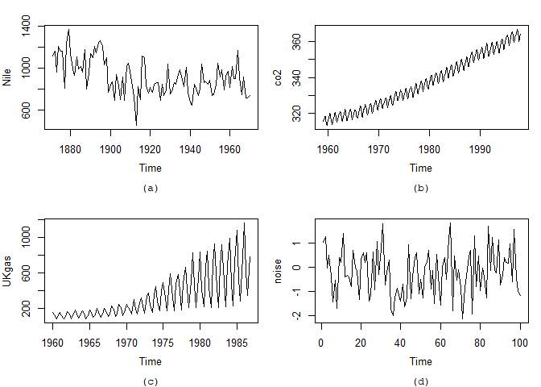

``` r
# post-processing
par(oldpar)
```

- The Nile data, despite our prior knowledge, doesn’t depict a crazy
  jump in 1899. We might model this as noise.
- The co2 data shows clear periodicity and an increasing trend over
  time.
- The gas data shows clear periodicity and an increasing trend over
  time, though the spread of the peak/valley is increasing regularly as
  well.
- Finally, the random noise is, well, random noise (though it’s crazy
  how often we can convince ourselves that there’s a pattern in random
  noise!).
- Two common transformations for time series analyses are *differences*
  and *log transforms*.
- Taking the differences of values converts a non-stationary time series
  to a stationary one — we don’t necessarily need to worry about that
  for state-space models.
- Taking the log, however, can still be useful:

``` r
UKgas |>
  log() |>
  plot()
```

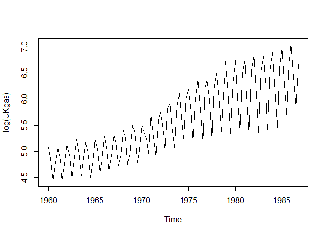

### 4.2.2 Histogram and Five-Number Summary

- Aka, just call `hist()` and `quantile()` dawg

``` r
oldpar <- par(no.readonly = TRUE)
par(mfrow = c(2, 2), 
    oma = c(0, 0, 0, 0), 
    mar = c(5, 3.5, 2, 1),
    mgp = c(2.5, 1, 0))

# hist-o-gram-a-ram-a
hist(Nile)
hist(co2)
hist(log(UKgas))
hist(noise)
```

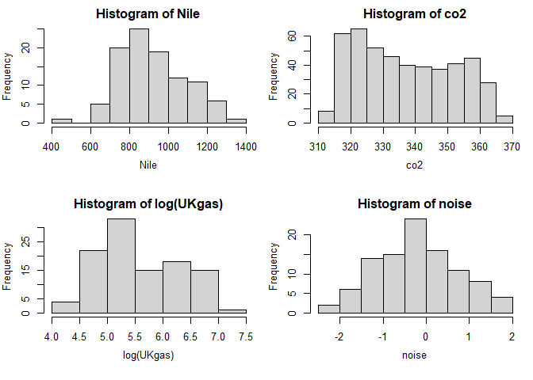

``` r
par(oldpar)

summary(Nile)
```

       Min. 1st Qu.  Median    Mean 3rd Qu.    Max. 
      456.0   798.5   893.5   919.4  1032.5  1370.0 

``` r
summary(co2)
```

       Min. 1st Qu.  Median    Mean 3rd Qu.    Max. 
      313.2   323.5   335.2   337.1   350.3   366.8 

``` r
summary(log(UKgas))
```

       Min. 1st Qu.  Median    Mean 3rd Qu.    Max. 
      4.440   5.032   5.398   5.579   6.152   7.060 

``` r
summary(noise)
```

       Min. 1st Qu.  Median    Mean 3rd Qu.    Max. 
    -2.1440 -0.9125 -0.2766 -0.2178  0.4495  1.8243 

- Note that `summary()` will also return the number of `NA`s, if any.
- Let’s talk about dealing with outliers and missing observations:
  - Outliers are literally data. Don’t just delete. If it’s confirmed
    that it’s a mistaken entry without being recoverable, that’s okay,
    but don’t delete an outlier to make your analysis look better
    (that’s literally fraud dawg).
  - Hmmm. I actually don’t like the way that Hagiwara deals with `NA`s.
    In his co2 data, he replaces missing values with the average of
    values around it (this gets around the limitations of the
    Holt-Winters method later in the book). I’m going to follow along
    for now, but note that the state-space model is better equipped to
    handle missing values naturally.

### 4.2.3 Autocorrelation Coefficient

``` r
oldpar <- par(no.readonly = TRUE)
par(mfrow = c(2, 2),
    oma = c(0, 0, 0, 0),
    mar = c(5, 3.5, 2, 1),
    mgp = c(2.5, 1, 0))

acf(Nile, sub = "Nile")
acf(co2, sub = "CO2")
acf(log(UKgas), sub = "log(UKgas)")
acf(noise, sub = "Noise")
```

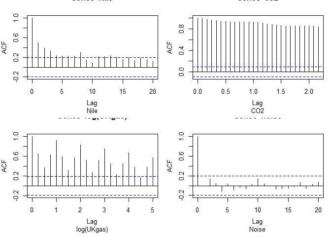

``` r
par(oldpar)
```

- Autocorrelation plots help us gauge whether or not a time series
  analysis is worth conducting (vs random noise).
- In the Nile data, points distant in time have low correlation with the
  current time period.
- In the UKgas data, the regular spikes indicate periodicity.
- The co2 data we know exhibits periodicity, but the long term positive
  trend dominates the autocorrelation function.

### 4.2.4 Frequency Spectrum

- Moving data from the time domain to the frequency domain is useful for
  confirming periodicity.
- A dominant trend can bury relativy small periodicty that the
  autocorrelation coefficient may have difficulty distinguishing.

#### 4.2.4.1 Fundamentals of Frequency

- The Fourier series expansion is an approximation of a signal using
  additive trig functions.
- See pages 39/40 for a detailed explanation of Fourier
  series/transforms.
- The important takeaway is that the full Fourier transform of a time
  series data only converts the series from the time domain to the
  frequency domain, it doesn’t increase/decrease the information in the
  data!

#### 4.2.4.2 Frequency Domain Transform

``` r
plot_spectrum <- function(data,
                          lab = "",
                          sub = "",
                          y_max = 1,
                          tick = c(8, 4), 
                          unit = 1) {
  
  # frequency domain transform
  data_fft <- abs(fft(as.vector(data)))
  
  # prep for plotting frequency on the horizontal axis
  data_length <- length(data_fft)
  freq_tick <- c(data_length, tick, 2)
  
  # plot!
  plot(data_fft/max(data_fft),
       type = "l",
       main = "",
       ylab = "|Standardized frequency spectrum|",
       ylim = c(0, y_max),
       xlab = sprintf("Frequency (1/%s)", lab),
       xlim = c(1, data_length/2),
       xaxt = "n")
  
  title(sub = sub, line = 4, family = "mono")
  axis(side = 1,
       at = data_length/freq_tick * unit + 1,
       labels = sprintf("1/%d", freq_tick),
       cex.axis = 0.7)
  
}

oldpar <- par(no.readonly = TRUE)
par(mfrow = c(2, 2),
    oma = c(0, 0, 0, 0),
    mar = c(5, 3.5, 2, 1),
    mgp = c(2.5, 1, 0))

plot_spectrum(Nile, lab = "Year", sub = "Nile")
plot_spectrum(co2, lab = "Month", sub = "CO2")
plot_spectrum(log(UKgas), lab = "Month", sub = "log(UKgas)")
plot_spectrum(noise, lab = "unit", sub = "Noise")
```

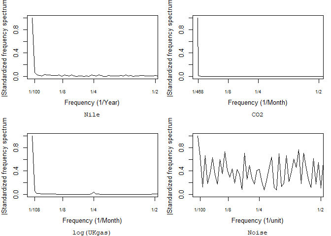

``` r
par(oldpar)
```

- The left side shooting up indicates that the max of the frequency
  spectrum of the Nile/CO2/UKgas data is basically when the data is
  right on top of each other.
- Limiting the axis reveals small frequency spikes in the CO2/gas data
  that align to monthly periodicty:

``` r
oldpar <- par(no.readonly = TRUE)
par(mfrow = c(2, 2),
    oma = c(0, 0, 0, 0),
    mar = c(5, 3.5, 2, 1),
    mgp = c(2.5, 1, 0))

plot_spectrum(Nile, lab = "Year", sub = "Nile", y_max = 0.02)
plot_spectrum(co2, lab = "Month", sub = "CO2", y_max = 0.02)
plot_spectrum(log(UKgas), lab = "Month", sub = "log(UKgas)", y_max = 0.02)
plot_spectrum(noise, lab = "unit", sub = "Noise", y_max = 0.02)
```

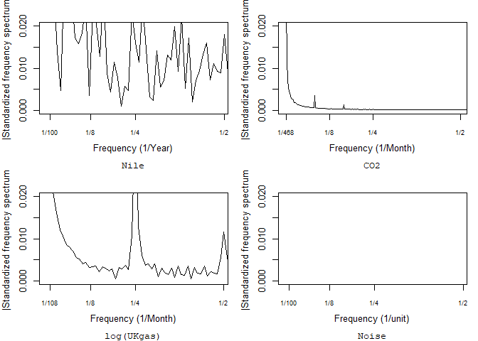

``` r
par(oldpar)
```

## 4.3 Model Definition

- Hagiwara uses “model definition” as a synonym for “decomposition.”
- Hagiwara explicitly recommends “*level* + *trend* + *season*” as a
  starting point for a time series decomposition, and examining the
  residuals.
- We’ll walk through some actual modeling with the example datasets.

## 4.4 Specification of Parameter Values

- Let’s start with the *Holt-Winters* method for analysis.
- Holt-Winters is a kind of exponentially weighted moving average.
- When observations with a period $p$ are obtained until $y_t$, the
  $k$-steps-ahead prediction value $\hat{y}_{t+k}$ obtained by the
  additive Holt-Winters method is:

$$
\begin{align*}
\hat{y}_{t+k} &= \text{level}_t + \text{trend}_t k + \text{season}_{t - p + k_p^+} \\
\text{level}_t &= \alpha(y_t - \text{season}_{t - p}) + (1 - \alpha)(\text{level}_{t-1} + \text{trend}_{t-1}) \\
\text{trend}_t &= \beta(\text{level}_t - \text{level}_{t-1}) + (1 - \beta)\text{trend}_{t - 1} \\
\text{season}_t &= \gamma(y_t - \text{level}_t) + (1 - \gamma)\text{season}_{t-p} \\
\end{align*}
$$

- $k_p^+ = \lfloor(k-1) \text{mod}\ p \rfloor + 1$
- $k_p^+ = p$ for $k = 0$
- $\hat{y}_t$ for $k = 0$ corresponds to the filtering value.
- $\alpha$, $\beta$, and $\gamma$ are an exponential weight and can take
  values between 0 and 1.
- The Holt-Winters method is deterministic, but is *almost* equivalent
  to an ARIMA model.
- Most software will determine the parameters of the model by minimizing
  the rmse of the prediction of the next time point over all time
  points.

## 4.5 Execution of Filtering, Prediction, and Smoothing

- Here, we’ll specify only a *level* component ($\alpha$) for the Nile
  data, remove the *seasonal* component ($\gamma$) for the random noise,
  and use full Holt-Winters for all others:

``` r
hw_nile <- HoltWinters(Nile, beta = FALSE, gamma = FALSE)
hw_nile
```

    Holt-Winters exponential smoothing without trend and without seasonal component.

    Call:
    HoltWinters(x = Nile, beta = FALSE, gamma = FALSE)

    Smoothing parameters:
     alpha: 0.2465579
     beta : FALSE
     gamma: FALSE

    Coefficients:
          [,1]
    a 805.0389

``` r
hw_co2 <- HoltWinters(co2)
hw_ukgas <- HoltWinters(log(UKgas))
hw_noise <- HoltWinters(noise, gamma = FALSE)
```

    Warning in HoltWinters(noise, gamma = FALSE): optimization difficulties: ERROR:
    ABNORMAL_TERMINATION_IN_LNSRCH

``` r
oldpar <- par(no.readonly = TRUE)
par(mfrow = c(2, 2),
    oma = c(0, 0, 0, 0),
    mar = c(5, 3.5, 2, 1),
    mgp = c(2.5, 1, 0))

plot(hw_nile, main = "", sub = "Nile")
plot(hw_co2, main = "", sub = "CO2")
plot(hw_ukgas, main = "", sub = "log(UKgas)")
plot(hw_noise, main = "", sub = "Noise")
```

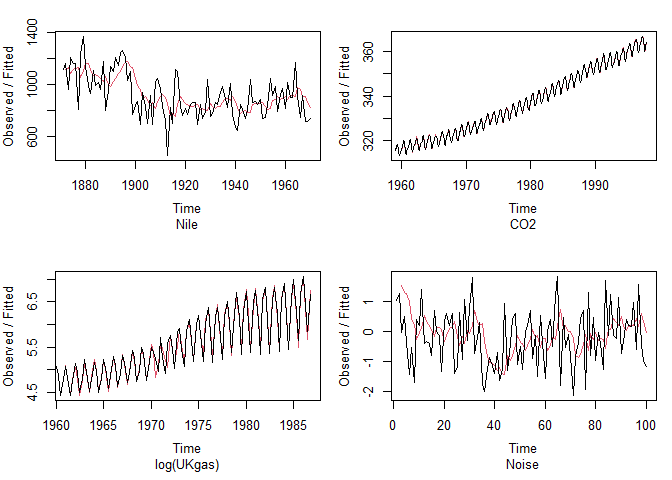

- We an also check out the `residuals()` and the individual components
  of Holt-Winters:

``` r
ts.union(y = hw_nile$x,
         level = hw_nile$fitted[,"level"],
         residuals = residuals(hw_nile)) |>
  plot(main = "",
       cex.lab = 1.3, 
       cex.axis = 1.5,
       mar = c(0, 5, 1, 1))
```

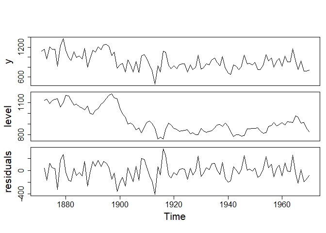

``` r
ts.union(y = hw_co2$x,
         level = hw_co2$fitted[,"level"] + hw_co2$fitted[,"trend"],
         season = hw_co2$fitted[,"season"],
         residuals = residuals(hw_co2)) |>
  plot(main = "",
       cex.lab = 1.3,
       cex.axis = 1.5,
       mar = c(0, 5, 1, 1))
```

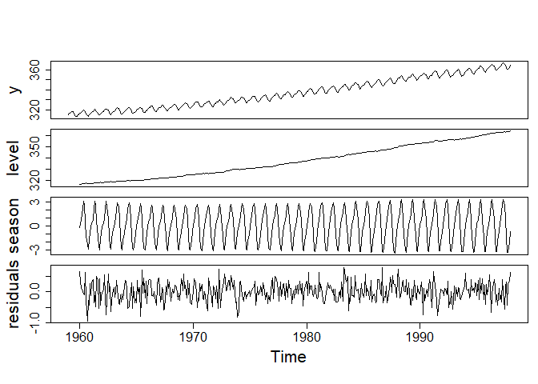

``` r
ts.union(y = hw_ukgas$x,
         level = hw_ukgas$fitted[,"level"] + hw_ukgas$fitted[,"trend"],
         season = hw_ukgas$fitted[,"season"],
         residuals = residuals(hw_ukgas)) |>
  plot(main = "",
       cex.lab = 1.3, 
       cex.axis = 1.5,
       mar = c(0, 5, 1, 1))
```

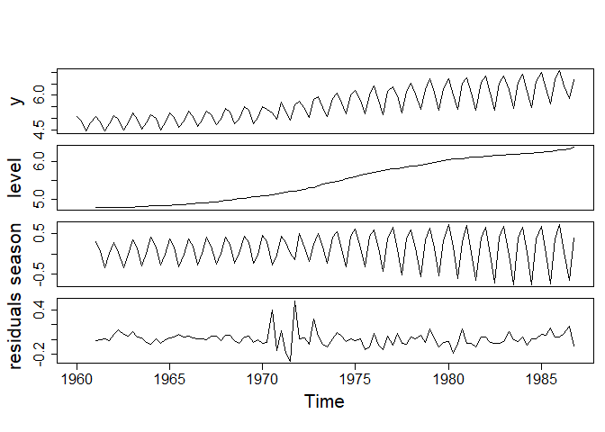

``` r
ts.union(y = hw_noise$x,
         level = hw_noise$fitted[,"level"] + hw_noise$fitted[,"trend"],
         residuals = residuals(hw_noise)) |>
  plot(main = "",
       cex.lab = 1.3,
       cex.axis = 1.5,
       mar = c(0, 5, 1, 1))
```

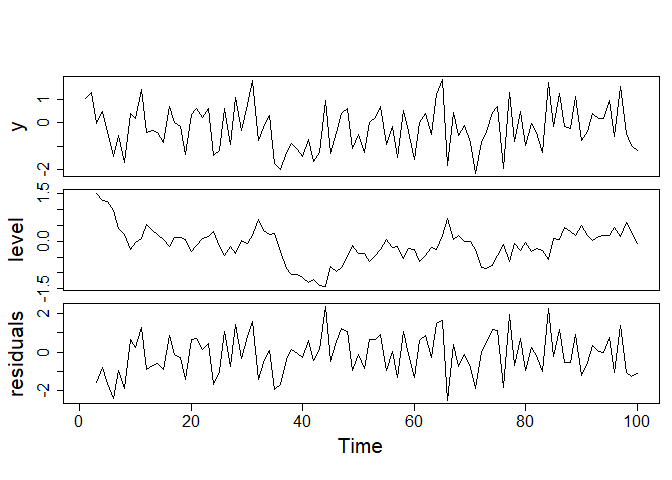

- We can also `predict()` ahead:

``` r
plot(hw_nile, predict(hw_nile, n.ahead = 12), main = "Nile")
```

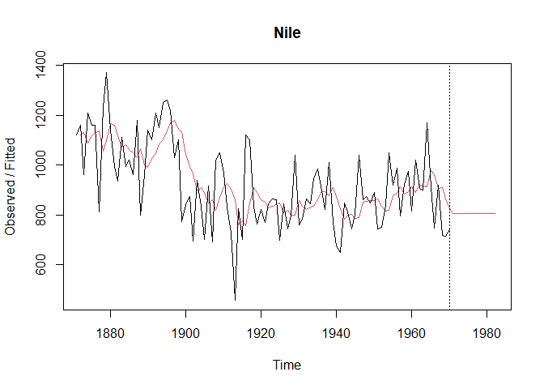

``` r
plot(hw_co2, predict(hw_co2, n.ahead = 12), main = "CO2")
```

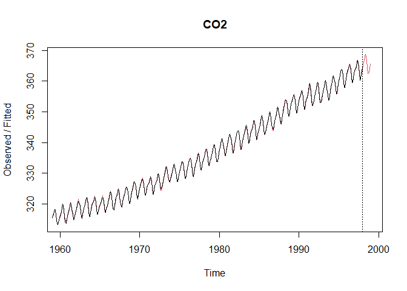

``` r
plot(hw_ukgas, predict(hw_ukgas, n.ahead = 12), main = "log(UKgas)")
```

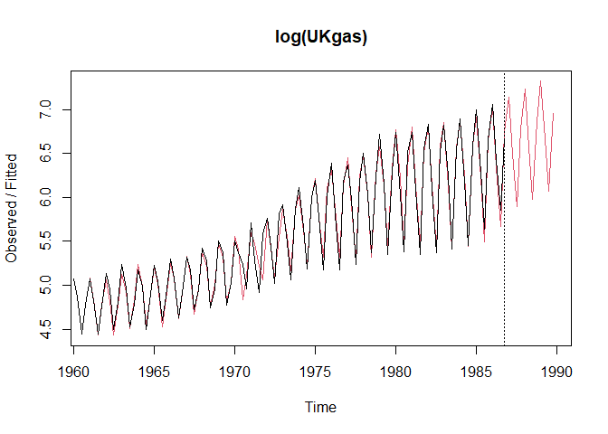

``` r
plot(hw_noise, predict(hw_noise, n.ahead = 12), main = "Noise")
```

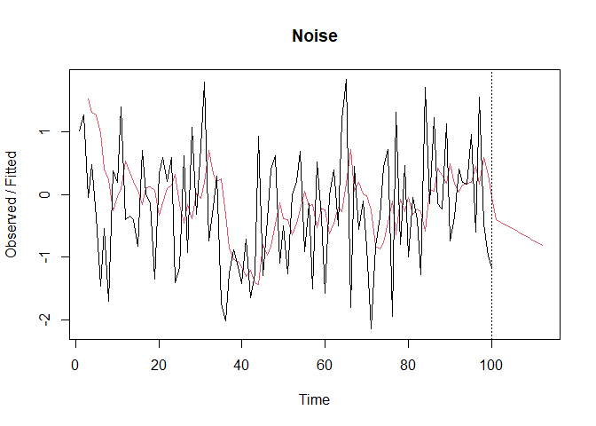

- Fitting data to noise yields a bad prediction!

## 4.6 Diagnostic Checking for the Results

- Residuals are useful for checking analysis.
- We can also check the autocorrelation of the residuals:

``` r
oldpar <- par(no.readonly = TRUE)
par(mfrow = c(2, 2), 
    oma = c(0, 0, 0, 0), 
    mar = c(5, 3.5, 2, 1), 
    mgp = c(2.5, 1, 0))

acf(residuals(hw_nile), main = "", sub = "Nile")
acf(residuals(hw_co2), main = "", sub = "CO2")
acf(residuals(hw_ukgas), main = "", sub = "log(UKgas)")
acf(residuals(hw_noise), main = "", sub = "Noise")
```

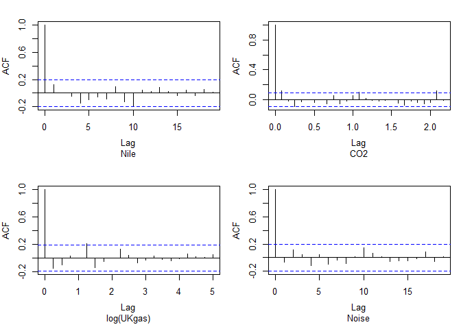

``` r
par(oldpar)
```

- Checking the validity of the predictions is also worthwhile to ensure
  we don’t see strange behavior.
- The noise model, for example, makes bad future predictions! (because
  it’s a bad model)
- We can also check prediction accuracy with metrics like MAPE, rmse,
  etc.

## 4.7 Guideline When Applying the State-Space Model

- The Holt-Winters model is deterministic, though the Hagiwara
  recommends stochastic models going forward. This is how the state
  space model is implemented.
- The state space model has two types of solutions:
  - The *batch solution*, which is suitable for fixed-interval
    smoothing.
  - The *sequential solution*, which is suitable for fixed-lag
    smoothing.
- Additionally, the state-space model can be roughly classified into two
  groups: the *linear Gaussian state-space model* and the *general
  state-space model*.
- The linear state-space model, there is a computationally efficient
  solving algorithm, while the general state-space model typically
  requires more computation (e.g., MCMC).
- We’ll look at several model types:

``` r
tibble::tibble(Model = c("Linear Gaussian", "General"),
               `Batch type` = c("Wiener Filter", "MCMC"),
               `Sequential type` = c("Kalman Filter", "Particle Filter")) |>
  knitr::kable()
```

| Model           | Batch type    | Sequential type |
|:----------------|:--------------|:----------------|
| Linear Gaussian | Wiener Filter | Kalman Filter   |
| General         | MCMC          | Particle Filter |
