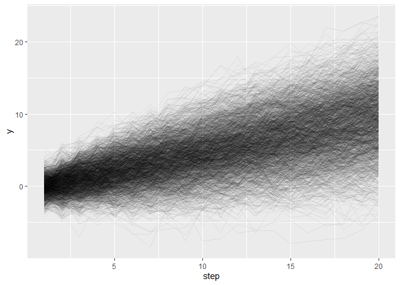

Chapter 6: Estimation in the State-Space
================

## 6.1 State Estimation Through the Posterior Distribution

- The *joint posterior distribution of the state* is given as:

$$
p(x_0, x_1, \dots, x_t^{'}, \dots | y_{1:t}) \\
$$

- This is also used as the target distribution for sampling in Stan.
- *smoothing*: $t^{'} < t$
- *filtering*: $t^{'} = t$
- *prediction*: $t^{'} > t$
- Can also *marginalize* (integrate) the joint distribution at all
  points other than the focused $t^{'}$.

## 6.2 How to Obtain the State Sequentially

### 6.2.1 A Simple Example

- Let’s focus only on the filtering case for this example (filtering
  includes one-step-ahead prediction partially, and smoothing results
  from filtering).  
- Let’s pretend there’s a cat with a gps tracker on it’s collar and the
  cat moves away from the home with an average speed:

$$
\begin{align*}
x_t &= x_{t-1} + v + w_t \\
y_t &= x_t + v_t \\
w_t &\sim \text{Normal}(0, \sigma_w^2) \\
v_t &\sim \text{Normal}(0, \sigma^2) \\
p(x_0) &\sim \text{Normal}(m_0, C_0)
\end{align*}
$$

- Here, $x_t$ is the position at time point $t$, $v$ is the average
  velocity (constant), $w_t$ is the fluctuation in velocity during
  movement, $y_t$ is the observation at time $t$, $v_t$ is the noise in
  observation, and $p(x_0)$ is the prior distribution for position at
  time 0.
- We estimate the cat’s position at $t_0$, then multiply the prior
  distribution by the likelihood based on an observed at $t_1$ to get
  the posterior for $t_1$. Rinse & repeat dawg.

``` r
library(tidyverse) 
```

    Warning: package 'tidyverse' was built under R version 4.2.3

    Warning: package 'ggplot2' was built under R version 4.2.3

    Warning: package 'tibble' was built under R version 4.2.3

    Warning: package 'readr' was built under R version 4.2.3

    Warning: package 'dplyr' was built under R version 4.2.3

    Warning: package 'lubridate' was built under R version 4.2.3

    ── Attaching core tidyverse packages ──────────────────────── tidyverse 2.0.0 ──
    ✔ dplyr     1.1.1     ✔ readr     2.1.4
    ✔ forcats   1.0.0     ✔ stringr   1.5.0
    ✔ ggplot2   3.4.2     ✔ tibble    3.2.1
    ✔ lubridate 1.9.2     ✔ tidyr     1.3.0
    ✔ purrr     1.0.1     
    ── Conflicts ────────────────────────────────────────── tidyverse_conflicts() ──
    ✖ dplyr::filter() masks stats::filter()
    ✖ dplyr::lag()    masks stats::lag()
    ℹ Use the conflicted package (<http://conflicted.r-lib.org/>) to force all conflicts to become errors

``` r
# fix params
v <- 0.5
sigma_w <- 1
sigma_v <- 1
steps <- 20

# simulate
x0 <- rnorm(2e3)
wt <- replicate(steps, rnorm(2e3, 0, sigma_w))
vt <- replicate(steps, rnorm(2e3, 0, sigma_v))

xt <- matrix(nrow = 2e3, ncol = steps)
y <- matrix(nrow = 2e3, ncol = steps)

for (i in 1:length(x0)) {
  for (j in 1:steps) {
    if (j == 1) {
      xt[i,j] <- x0[i]
    } else {
      xt[i,j] <- xt[i,j-1] + v + wt[i,j]
    }
    y[i,j] <- xt[i,j] + vt[i,j]
  }
}  

# plot
y %>%
  as_tibble() %>%
  rowid_to_column("sim") %>%
  pivot_longer(starts_with("V"),
               names_to = "step",
               values_to = "y") %>%
  mutate(step = parse_number(step)) %>%
  ggplot(aes(x = step, 
             y = y, 
             group = sim)) + 
  geom_line(alpha = 0.0625)
```

    Warning: The `x` argument of `as_tibble.matrix()` must have unique column names if
    `.name_repair` is omitted as of tibble 2.0.0.
    ℹ Using compatibility `.name_repair`.



- The prior distribution at $t=2$ corresponds to the posterior
  distribution at $t=1$.
- The uncertainty inherently keeps growing as we get further in time
  because of the state fluctuation, $w_t$ (**note**: the increasing
  variation *doesn’t* depend on $y_t$!!)
- View pages 72-74 for the exact posterior solution (normal/normal
  conjugate).
- This is, effectively, the Kalman filter.

### 6.2.2 Conceptual Diagram of Recursion

- See diagram on page 75…

### 6.2.3 Formulation of Filtering Distribution

- See pages 75-78 for a derivation of the filtering distribution.
- There’s also a more intuitive version of the recursion graph on page
  78.

### 6.2.4 Formulation of Predictive Distribution

- This is for $k$-steps ahead prediction.
- See page 79 for the derviation and equation.
- See the diagram on page 80 — you don’t actually need to estimate all
  the $y_{\text{observed}}$ in between $t$ and $t+k$, you just need to
  estimate the states and the observation at $t+k$!
- *This means we can easily handle missing observations in the state
  space model*.

### 6.2.5 Formulation of the Smoothing Distribution

- To perform smoothing, we first assume that filtering has been
  completed through time point $T$.
- See pages 81-82 for the derivation of the smoothing distribution.
- In essence, smoothing corrects the filtering distribution in reverse:
  smoothing distribution at $T-1$ is corrected based on the smoothing
  distribution at $T$.
- The smoothing distribution at $T$ corresponds to the filtering
  distribution at $T$.
- See page 83 for a figure that shows the recursive path of smoothing.

## 6.3 Likelihood and Model Selection in the State-Space Model

- More equation derivations on page 82.
- In essence, the log-likelihood for the entire time series can be
  represented as the sum of the logs of the one-step-ahead predictive
  likelihoods.
- This book treats likelihood as a model selecting criterion (others:
  AIC, WAIC, see more from Statistical Rethinking).

## 6.4 Treatment of Parameters in a State-Space Model

- The example had fixed parameters. We gotta estimate theme tho.

### 6.4.1 When Parameters are Not Regarded as Random Variables

- Frequentism.

### 6.4.2 When Parameters are Regarded as Random Variables

- Bayesianism.
