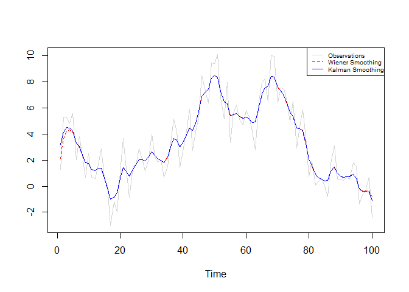

Chapter 7: Batch Solution for Linear Gaussian State-Space Model
================

## 7.1 Wiener Filter

- The optimal batch estimation method for the linear Gaussian
  state-space model is the *Wiener filter*.
- The Wiener filter assumes the time series is stationary.
- For stationary processes, the Wiener and Kalman filters yield the same
  results (the Kalman filter is more general, but we’ll start with the
  Wiener).

### 7.1.1 Wiener Smoothing

- The Wiener filter can formulate each of smoothing, filtering, and
  prediction, but among these, smoothing is the most straightforward.
- Consider the figure on page 91 and the following equations:

$$
\begin{align*}
y_t &= x_t + v_t \\
d_t &= h_t\ \text{*}\ y_t
\end{align*}
$$

- Independent white noise $v_t$ is added to the original data $x_t$ to
  produce an observation $y_t$.
- Next the observations $y_t$ are passed to the Wiener filter $h_t$ and
  desired signal $d_t$ is derived as the point estimates for the
  original data $x_t$.
- The transfer function of the Wiener function is expressed as:

$$
\begin{align*}
H(z) &= \frac{S_{xx}(z)}{S_{xx}(z)+S_{vv}(z)} \\
&= \frac{1}{1+\frac{S_{vv}(z)}{S_{xx}(z)}}
\end{align*}
$$

- If there is no noise, $S_{vv}(z)=0$ and $H(z)=1$ (i.e., we can rely
  entirely on observations).
- On the other hand, if the noise is dominant,
  $S_{vv}(z)\rightarrow\infty$ then $H(z)=0$ and we can’t rely on the
  observations at all!
- When there is finite noise, $H(z)$ decreases according to the power
  ratio of the noise to the original data.

## 7.2 Example: AR(1) Model Case

- Let’s assume the original data $x_t$ follow the AR(1) model, with
  observations $y_t$:

$$
\begin{align*}
x_t &= \phi x_{t-1} + w_t \\
y_t &= x_t + v_t \\
w_t &\sim \text{Normal}(0, W) \\
v_t &\sim \text{Normal}(0, V)
\end{align*}
$$

- When $|\phi|<1$ (stationary process), we can derive the desired $d_t$
  analytically with the Wiener smoothing (see equation 7.6 on page 92).
- Here, we show the equivalence between the Wiener and Kalman filters
  for the AR(1) case:

``` r
library(dlm)
```

    Warning: package 'dlm' was built under R version 4.2.3

``` r
set.seed(23)

# setting of state space model including AR(1)
W <- 1
V <- 2
phi <- 0.98 # AR(1) coeficient
mod <- dlmModPoly(order = 1, dW = W, dV = V, C0 = 100)
mod$GG[1, 1] <- phi

# generate observations using kalman prediction
t_max <- 100
sim_data <- dlmForecast(mod = mod, nAhead = t_max, sampleNew = 1)
y <- sim_data$newObs[[1]]

# kalman smoothing
dlmSmoothed_obj <- dlmSmooth(y = y, mod = mod)
s <- dropFirst(dlmSmoothed_obj$s)

# wiener smoothing 
# set coefficients
r <- V/W
b <- 1/(r*phi) + 1/phi + phi
beta <- (b - sqrt(b^2 - 4))/2

# supplement the minimum required dummy 0s before/after finite observations
y_expand <- c(rep(0, t_max-1), y, rep(0, t_max-1))

# execution of wiener smoothing
d <- (1/phi - beta)*(phi - beta) / (1-beta^2) * 
  filter(method = "convolution",
         filter = beta^abs(-(t_max-1):(t_max-1)), x = y_expand)

# remove dummy na's from the result
d <- d[!is.na(d)]

# plot results
ts.plot(cbind(y, d, s),
        lty = c("solid", "dashed", "solid"),
        col = c("lightgray", "red", "blue"),
        ylab = "")

legend(legend = c("Observations",
                  "Wiener Smoothing",
                  "Kalman Smoothing"),
       lty = c("solid", "dashed", "solid"),
       col = c("lightgray", "red", "blue"),
       x = "topright",
       text.width = 17,
       cex = 0.6)
```


