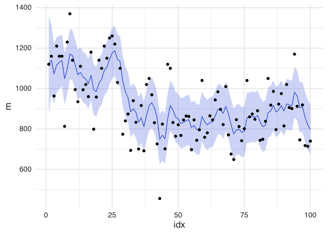

# Chapter 8: Sequential Solution for Linear Gaussian State-Space Model

``` r
library(tidyverse)
```

    ── Attaching core tidyverse packages ──────────────────────── tidyverse 2.0.0 ──
    ✔ dplyr     1.1.3     ✔ readr     2.1.4
    ✔ forcats   1.0.0     ✔ stringr   1.5.0
    ✔ ggplot2   3.4.4     ✔ tibble    3.2.1
    ✔ lubridate 1.9.3     ✔ tidyr     1.3.0
    ✔ purrr     1.0.2     
    ── Conflicts ────────────────────────────────────────── tidyverse_conflicts() ──
    ✖ dplyr::filter() masks stats::filter()
    ✖ dplyr::lag()    masks stats::lag()
    ℹ Use the conflicted package (<http://conflicted.r-lib.org/>) to force all conflicts to become errors

``` r
library(riekelib)
```

## 8.1 Kalman Filter

- The optimal sequential estimation method for the linear Gaussian
  state-space model is the *Kalman filter*.
- Unlike the Wiener filter, the Kalman filter can handle non-stationary
  processes.

$$
\begin{align*}
x_t &= G_t x_{t-1} + w_t \\
y_t &= F_t x_t + v_t \\
w_t &\sim \text{Normal}(0, W_t) \\
v_t &\sim \text{Normal}(0, V_t) \\
x_0 &\sim \text{Normal}(m_0, C_0)
\end{align*}
$$

- $G_t$ is the $p \times p$ state transition matrix; $F_t$ is the
  $1 \times p$ observation matrix, $W_t$ is the $p \times p$ covariance
  matrix of the state noise, and $V_t$ is the variance of the
  observation noise.
- For time $t=0$, $m_0$ is the $p$-dimensional mean vector and $C_0$ is
  the $p \times p$ covariance matrix.

### 8.1.1 Kalman Filtering

- Given distribution at time $t-1$: $m_{t-1}$, $C_{t-1}$:
- Update the *one step ahead predictive distribution*
  - (Mean): $a_t = G_t m_{t-1}$
  - (Covariance): $R_t = G_t C_{t-1} G_t^\top + W_t$
- Update the *one step ahead predictive likelihood*
  - (Mean): $f_t = F_t a_t$
  - (Covariance): $Q_t = F_t R_t F_t^\top + V_t$
- Update the *Kalman gain*
  - $K_t = R_t F_t^\top Q_t^{-1}$
- Update the *filtering distribution*
  - (Mean): $m_t = a_t + K_t [y_t - f_t]$
  - (Covariance): $C_t = [I - K_t F_t] R_t$
- In plain english:
  - *One step ahead predictive distribution*: the filtering distribution
    one time before is transitioned forward based on the state equation.
  - *One step ahead predictive likelihood*: the one step ahead
    predictive distribution is converted to the domain of observations.
  - *Filtering distribution*: the one step ahead predictive distribution
    is corrected based on the likelihood
- In code:

``` r
# kalman filtering from scratch!

# flow data in the nile as observations, y
y <- Nile
t_max <- length(y)

# perform kalman filtering for a given time point t
kalman_filtering <- function(m_t_minus_1,
                             C_t_minus_1,
                             t) {
  
  # one step ahead predictive distribution
  a_t <- G_t %*% m_t_minus_1
  R_t <- G_t %*% C_t_minus_1 %*% t(G_t) + W_t
  
  # one step ahead predictive likelihood
  f_t <- F_t %*% a_t
  Q_t <- F_t %*% R_t %*% t(F_t) + V_t
  
  # kalman gain
  K_t <- R_t %*% t(F_t) %*% MASS::ginv(Q_t)
  
  # state update
  m_t <- a_t + K_t %*% (y[t] - f_t)
  C_t <- (diag(nrow(R_t)) - K_t %*% F_t) %*% R_t
  
  # return the mean/variance of the filtering & one-step-ahead predictive distributions
  out <- 
    list(
      m = m_t,
      C = C_t,
      a = a_t,
      R = R_t
    )
  
  return(out)
  
}

# set parameters for the the linear gaussian state space
# (all 1x1 matrices here)
G_t <- matrix(1)
W_t <- matrix(exp(7.29))
F_t <- matrix(1)
V_t <- matrix(exp(9.62))
m0 <- matrix(0)
C0 <- matrix(1e7)

# empty vectors for results
m <- rep(NA_real_, t_max)
C <- rep(NA_real_, t_max)
a <- rep(NA_real_, t_max)
R <- rep(NA_real_, t_max)

# time t=1
KF <- kalman_filtering(m0, C0, t = 1)
m[1] <- KF$m
C[1] <- KF$C # the colonel >:)
a[1] <- KF$a
R[1] <- KF$R

# remaining time points
for (t in 2:t_max) {
  KF <- kalman_filtering(m[t - 1], C[t - 1], t = t)
  m[t] <- KF$m
  C[t] <- KF$C
  a[t] <- KF$a
  R[t] <- KF$R
}

tibble(m, C, y) %>%
  rowid_to_column("idx") %>%
  mutate(sd = sqrt(C)) %>%
  normal_interval(m, sd) %>%
  select(-c(C, sd)) %>%
  ggplot(aes(x = idx)) + 
  geom_ribbon(aes(ymin = ci_lower,
                  ymax = ci_upper),
              alpha = 0.25,
              fill = "royalblue") +
  geom_line(aes(y = m),
            color = "royalblue") +
  geom_point(aes(y = y)) +
  theme_rieke(base_family = "sans")
```


